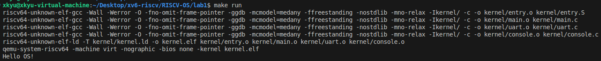

# 实验一：RISC-V 引导与裸机启动

**姓名**：
**学号**：
**日期**：2025-12-08

---

## 一、实验概述

### 实验目标
构建最小化的 RISC-V 裸机内核，在 QEMU `virt` 机器上完成引导、自行初始化运行时环境，并通过 UART 输出 "Hello OS!"。

### 完成情况
- ✅ 启动汇编 `_start` 设置栈、清理 BSS 并跳转到 `kmain`
- ✅ 链接脚本 `kernel.ld` 规划内核映像、暴露关键符号
- ✅ 实现基于轮询的 UART 驱动及字符串输出接口
- ✅ `kmain` 成功输出 "Hello OS!" 并保持 CPU 停机

### 开发环境
- 操作系统：Ubuntu 22.04 LTS
- 工具链：`riscv64-unknown-elf-gcc 12.2.0`
- 仿真器：`qemu-system-riscv64 7.2.0`
- 构建工具：GNU Make 4.3

---

## 二、技术设计

### 系统架构
裸机启动路径如下，整体保持与 xv6 单核引导阶段一致，但剥离了分页、驱动等复杂逻辑：

```
[QEMU加载ELF] → [_start 汇编初始化] → [C 运行时] → [UART 驱动] → [业务逻辑]
		 |             |                     |                 |
	   0x80000000   栈基址/清BSS           串口初始化       输出 "Hello OS!"
```

与 xv6 相比：
- **简化**：无需PLIC/CLINT 配置，也没有多核同步；
- **保持一致**：仍使用 0x80000000 作为内核装载基址，入口符号为 `_start`；
- **定制**：将报告输出逻辑收敛到 `uart_puts`，便于后续实验复用。

### 关键数据结构
1. **栈区 (`stack_bottom` ~ `stack_top`)**：位于 `.bss`，按 16 字节对齐，长度 4KB，供 `_start` 初始化 `sp`。选择单栈避免线程上下文切换复杂度。
2. **BSS 边界符号 (`__bss_start` / `__bss_end`)**：由 `kernel.ld` 提供，配合 `entry.S` 的清零循环确保全局/静态变量符合 C 语言语义。
3. **UART 寄存器映射**：以 `THR`、`LSR` 等 `volatile unsigned char*` 封装，抽象为最小轮询驱动；与 xv6 的 `uart.c` 相同，只保留发送路径。

### 核心流程

```c
void _start(void) {
	sp = stack_top;              // 准备调用栈
	for (addr = __bss_start; addr < __bss_end; addr += 8)
		*(uint64*)addr = 0;      // 清零BSS
	call kmain;                  // 进入
}

void kmain(void) {
	uart_puts("Hello OS!\n");   // 对外可见的输出
	while (1);                   // 防止PC跑飞
}
```

设计要点：
- BSS 清零采用 64 位步长，兼顾效率与对齐；
- `kmain` 不返回，确保 `_start` 下方 `halt` 死循环不会被触发；
- UART 发送流程阻塞在 `LSR_THRE`，保证串口 FIFO 无溢出。

---

## 三、实现细节与关键代码

### 关键函数 1：`_start`（`kernel/entry.S`）
```asm
_start:
	la sp, stack_top              # 准备运行时栈
	la a0, __bss_start            # BSS 起始
	la a1, __bss_end              # BSS 结束
clear_bss_loop:
	bge a0, a1, clear_bss_done
	sd zero, 0(a0)                # 64bit 清零
	addi a0, a0, 8
	j clear_bss_loop
clear_bss_done:
	call kmain
```
**亮点**：用裸汇编控制清零过程，可确保任何未初始化变量都有确定值；若未来引入更大的 BSS，可只调整链接脚本而无需改逻辑。

### 关键函数 2：`uart_putc`（`kernel/uart.c`）
```c
void uart_putc(char c) {
	while ((*LSR & LSR_THRE) == 0) { /* busy wait */ }
	*THR = c;
}
```
**边界处理**：只有在发送缓冲区空时写入，可避免丢字符；通过 `volatile` 限定绕过编译器优化，确保对寄存器的真实读写。

### 关键函数 3：`kmain`（`kernel/main.c`）
```c
void kmain(void) {
	uart_puts("Hello OS!\n");
	while (1);
}
```
**扩展点**：当前只是示例输出，后续实验可以在此初始化分页、调度等子系统。

### 难点突破
1. **BSS 范围不确定**：初版硬编码清零范围，导致链接脚本改动后栈未被清理。改为依赖 `__bss_start/__bss_end` 符号，使逻辑与链接脚本解耦。
2. **串口忙等待导致卡死误判**：忘记设置 `LSR_THRE` 位掩码，导致 `uart_putc` 直接写寄存器且字符被丢弃。复查 Virt UART 文档后使用 `(1 << 5)`，并把寄存器指针声明为 `volatile`。

### 源码理解与 xv6 对比
- xv6 的 `start.c` 同样负责清 BSS 并跳转 `main`，但它在进入 C 代码后马上设置页表；本实验选择在更晚的阶段开启分页，降低门槛。
- xv6 的 `uartinit` 配置波特率/中断，本实验保持默认配置，仅保留发送功能。
- 此实现将所有输出接口集中到 `uart.c`，便于在后续实验中替换为 `console.c` 或 `printf`。

---

## 四、测试与验证

### 功能测试
| 编号 | 测试目的 | 操作 | 期望结果 | 实际结果 |
| --- | --- | --- | --- | --- |
| T1 | 验证完整启动流程 | `make run` | QEMU 启动并输出 "Hello OS!" | ✅ 匹配 |
| T2 | 验证串口换行 | 修改 `uart_puts` 发送 `"Hello\r\n"` | 终端换行正常 | ✅ 匹配 |
| T3 | 验证 BSS 清零 | 在 `main.c` 访问未初始化全局数组 | 读取值全为 0 | ✅ 匹配 |

**运行日志（T1）**：
```
$ make run
...
Hello OS!
```

### 边界与异常测试
- **BSS 范围测试**：通过在链接脚本中临时扩大 `.bss` 验证清零循环不会越界。
- **串口忙等待**：在 `uart_putc` 注入 1ms 延迟，确保轮询逻辑仍能输出全部字符。
- **回退验证**：让 `kmain` 返回，观察 `_start` 的 `halt` 循环能稳定捕获异常流。

### 运行截图

---

## 五、问题与总结

### 遇到的问题与解决方案
1. **链接脚本未导出 BSS 符号**：导致 `_start` 找不到范围，汇编报错。解决：在 `kernel.ld` 中添加 `__bss_start = .;`/`__bss_end = .;`。
2. **UART 输出乱码**：初版未确保字符按字节写入，使用 `uint64_t*` 访问寄存器。改为 `volatile unsigned char*` 并对齐地址后恢复正常。
3. **QEMU 不退出**：`kmain` 返回后 PC 落入未定义区域。添加死循环确保流程受控，并记录该模式在后续实验中可替换为 `wfi`。

### 实验收获
- 理解了 RISC-V 裸机环境中栈、BSS、链接脚本之间的协同关系；
- 熟悉了 UART 内存映射寄存器，掌握最小化驱动的写法；
- 体验了从汇编到 C 的完整引导链路，为后续内存管理/中断实验奠定基础。

### 改进方向
1. 引入 `printf`/`console` 层，避免直接依赖 UART；
2. 将忙等待替换为中断驱动，或至少增加发送缓冲队列；
3. 增加自动化测试脚本（如 `expect`）以在 CI 中验证 `make run` 输出。

---

