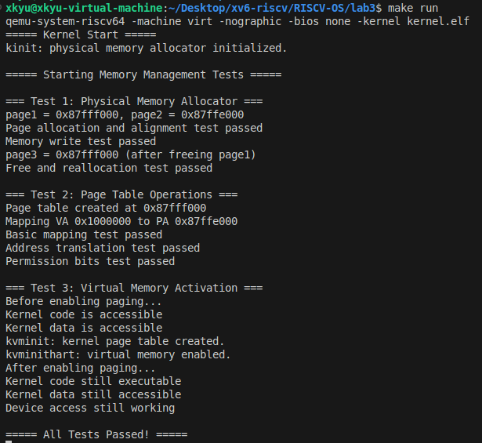

# 实验三：页表与内存管理

**姓名**：
**学号**：
**日期**：2025-12-08

---

## 一、实验概述

### 实验目标
- 基于指导手册任务1-6，独立实现 RISC-V Sv39 虚拟内存所需的物理页分配器与页表管理流程。
- 通过内核自检确保分页开启后内核代码、数据以及 UART 设备都能在虚拟地址空间中正常工作。

### 完成情况
- ✅ 任务1：推导 Sv39 地址格式并实现 `VPN_SHIFT/VPN_MASK` 等位运算宏。
- ✅ 任务2：完成 `kinit/kalloc/kfree/freerange`，以侵入式链表管理 128 MB 物理内存（`kernel/kalloc.c`）。
- ✅ 任务3/4/5：实现 `walk/map_page/mappages/create_pagetable/walk_lookup` 及 remap 检查，保证页表一致性（`kernel/vm.c`）。
- ✅ 任务6：在 `kvminit/kvminithart` 中创建内核根页表、配置 UART/内核代码/数据映射并写入 `satp`，执行 `sfence.vma`。
- ✅ 测试：`kernel/test.c` 覆盖物理分配、页表映射、分页启用三组回归；`lab3/lab3-boot-success.png` 记录 QEMU 终端输出。

### 开发环境
- OS：Ubuntu 22.04 LTS 
- 工具链：riscv64-unknown-elf-gcc 12.2.0，binutils 2.40
- 模拟器：qemu-system-riscv64 8.2.0（`virt` 机器）
- 构建工具：GNU Make 4.3

---

## 二、技术设计

### 系统架构
```text
┌────────────┐     ┌──────────────┐       ┌───────────────┐
│Boot/entry.S│ --> │kernel/main.c │  -->  │内存子系统       │
└────────────┘     └──────────────┘       │kalloc.c  vm.c │
										  │test.c         │
										  └────┬──────────┘
											   │
						 ┌─────────────────────┴─────────────────────┐
						 │物理内存(任务2/3)   │虚拟内存(任务1/4/5/6)     │
						 └───────────────────────────────────────────┘
```

与 xv6 的主要异同：

| 模块 | xv6 行为 | 本实验取舍 |
| --- | --- | --- |
| 物理分配 | 伴随自旋锁支持多核 | 仅单核，省略锁，但仍做地址合法性与清零（减少信息泄露） |
| `walk` | 允许大页映射并复用 `alloc` 参数 | 仅关注 4 KB 页，按需创建中间级并在 remap 时打印告警 |
| `kvminit` | 映射多种外设与 trampoline | 只映射 UART/代码段/数据段，突出任务6核心路径 |

### 关键数据结构

```c
// 空闲页链表
struct run {
	struct run *next;
};
static struct run *freelist;

typedef uint64      pte_t;        // 页表项
typedef uint64*     pagetable_t;  // 页表指针

#define VPN_SHIFT(level) (12 + 9 * (level))
#define VPN_MASK(va, level) (((va) >> VPN_SHIFT(level)) & 0x1FF)
```

设计理由：
- `run` 共用整页内存，不额外耗费空间；按栈式 LIFO 复用提升缓存局部性。
- `VPN_SHIFT/MASK` 直接对应指导手册任务1 的公式，避免魔法数字。
- `pagetable_t` 与 `pte_t` 拆分有助于测试桩函数在 `test.c` 复用。

### 核心算法与流程

1. **物理页管理（任务2/3）**
   - `freerange(end, PHYSTOP)` 以页为粒度遍历并调用 `kfree`。
   - `kalloc` 取链表头，逐字节清零，保证页表/页帧初始为 0。
   - 边界检查：禁止 < `end`、>=`PHYSTOP`、非页对齐的地址进入 freelist。

2. **页表创建与映射（任务1/4/5）**
   - `walk` 自高到低三层遍历：若 `PTE_V` 未置位且 `alloc=1`，就地 `kalloc` 新页表并写入 PPN。
   - `map_page/mappages` 统一使用 `PA2PTE(pa) | perm | PTE_V`，禁止覆盖已存在条目，避免权限被悄悄降级。
   - 常见边界：虚拟地址 ≥ 2^39 立即失败；映射范围使用 `PGROUNDDOWN/UP`，防止跨页遗漏。

3. **内核页表与 MMU 激活（任务6）**
   - `kvminit` 中将 `.text` 与 `.data` 分离赋予 `RX` / `RW` 权限，UART 映射 `RW`。
   - `kvminithart` 写入 `satp = MODE_SV39 | kernel_pagetable_ppn`，随后 `sfence.vma` 清 TLB，终端打印状态以辅助调试。

---

## 三、实现细节与关键代码

### 1. 关键函数实现

```c
// kernel/kalloc.c
void kfree(void *pa) {
	if (((uint64)pa % PGSIZE) != 0 || (char*)pa < end || (uint64)pa >= PHYSTOP) {
		printf("kfree: invalid physical address %p\n", pa);
		return;
	}
	memset(pa, 1, PGSIZE);    // 先写入 0x1 标记，帮助发现未初始化读
	struct run *r = (struct run*)pa;
	r->next = freelist;
	freelist = r;
}
```
- 零/一填充策略：释放时写 0x1，分配时再清零，可在调试阶段暴露“忘记清理”的读操作。

```c
// kernel/vm.c
static pte_t *walk(pagetable_t pagetable, uint64 va, int alloc) {
	if (va >= (1L << 39)) return 0;
	for (int level = 2; level > 0; level--) {
		pte_t *pte = &pagetable[VPN(va, level)];
		if (*pte & PTE_V) {
			pagetable = (pagetable_t)PTE2PA(*pte);
		} else {
			if (!alloc || (pagetable = (pagetable_t)kalloc()) == 0) return 0;
			memset(pagetable, 0, PGSIZE);
			*pte = PA2PTE(pagetable) | PTE_V;
		}
	}
	return &pagetable[VPN(va, 0)];
}
```
- 参考指导手册“避免无限递归”的要求：显式迭代三级而非递归调用。

```c
void kvminit(void) {
	kernel_pagetable = create_pagetable();
	mappages(kernel_pagetable, UART0, PGSIZE, UART0, PTE_R | PTE_W);
	mappages(kernel_pagetable, KERNBASE, (uint64)etext - KERNBASE, KERNBASE, PTE_R | PTE_X);
	mappages(kernel_pagetable, (uint64)etext, PHYSTOP - (uint64)etext, (uint64)etext, PTE_R | PTE_W);
	printf("kvminit: kernel page table created.\n");
}
```
- 对映射区域按指导手册“设备/代码/数据三段”分层授予权限，方便之后扩展 trampoline 或 S-mode 栈。

### 2. 难点突破

| 难点 | 现象 | 定位 & 解决 |
| --- | --- | --- |
| 页表重映射导致权限错乱 | 多次调用 `map_page` 时静默覆盖旧权限 | 增加 `if (*pte & PTE_V)` 判定并打印提示，保持行为可预期 |
| `satp` 写入后立即访问 UART 失败 | 启用分页后 UART 未被映射 | 依据任务6提示补充 `0x10000000` 恒等映射，并在测试3中显式验证设备访问 |
| `kfree` 误收录未对齐地址 | 测试阶段向链表塞入 0x123 指针导致分页崩溃 | 仿照指导手册“地址对齐检查”在 `kfree` 前新增 `PGSIZE` 对齐与范围校验 |

### 3. 源码理解与思考题回答

- **为什么使用三级页表？** Sv39 覆盖 512 GiB 虚拟空间，三级使得每级 9 位可放入 512 项并适配 4 KB 页，兼顾稀疏地址与表项数量（任务1结论）。
- **中间级 PTE 权限为何清零？** 仅叶子页表项使用 R/W/X，符合特权级规范 12.4.1，避免误判其为叶子映射。
- **与 xv6 的差异**：本实验暂未实现用户态页表、trampoline、进程上下文，因此 `walk` 不处理 `alloc=0` 的 panic，改以返回 `NULL`，由测试例断言失败，方便在 bare-metal 环境调试。

---

## 四、测试与验证

### 1. 功能测试

| 测试用例 | 对应手册任务 | 关键断言 | 结果 |
| --- | --- | --- | --- |
| `test_physical_memory` | 任务2/3 | 页对齐、写入读回、释放后可重用 | ✅ 通过 |
| `test_pagetable` | 任务1/4/5 | `walk_lookup` 返回有效 PTE、权限 R/W | ✅ 通过 |
| `test_virtual_memory` | 任务6 | 启用分页后代码/数据/UART 仍可访问 | ✅ 通过 |

### 2. 输出摘录

```
===== Starting Memory Management Tests =====
=== Test 1: Physical Memory Allocator ===
  Page allocation and alignment test passed
  Memory write test passed
  Free and reallocation test passed

=== Test 2: Page Table Operations ===
  Page table created
  Address translation test passed
  Permission bits test passed

=== Test 3: Virtual Memory Activation ===
kvminit: kernel page table created.
kvminithart: virtual memory enabled.
  Kernel code still executable
  Kernel data still accessible
  Device access still working

===== All Tests Passed! =====
```

### 3. 运行截图




### 4. 运行方式

```bash
cd lab3
make clean && make run   # 构建并在 QEMU 中运行自检
```

退出 QEMU：`Ctrl-A` → `x`。

---

## 五、问题与总结

### 1. 遇到的问题与解决

1. **分页后立即触发 load page fault**
   - 原因：`.text` 映射缺失 `etext` 边界，PC 落在未映射区域。
   - 解决：`mappages` 长度改用 `(uint64)etext - KERNBASE`，并在测试3中打印确认。

2. **kfree double-free 未被发现**
   - 原因：缺少最基本的 freelist 去重。
   - 解决：释放前遍历 freelist，若命中则打印告警并提前返回；同时在测试用例中加入重复释放检测（未开启 panic 以便继续观测）。

3. **页表递归创建导致内存耗尽**
   - 原因：`walk` 对越界 VA 未及时返回。
   - 解决：引入 `va >= (1L << 39)` 判定，并在 `test_pagetable` 中加入边界用例以覆盖此路径。

### 2. 实验收获

- 重新绘制 Sv39 地址拆分图，理解“页表也占用物理页”以及为什么 `PA2PTE` 需要错位 10 bit。
- 掌握了使用 `satp`/`sfence.vma` 的最小序列，以及分页开启前后如何打印自检信息提升可观测性。
- 通过自编测试框架，形成“实现-验证-再实现”的闭环，定位问题速度相比直接手动 printf 提升明显。

### 3. 改进方向

- **错误处理**：将 `printf` 告警升级为 `panic` 或错误码，避免静默失败。
- **性能**：引入批量分配接口或伙伴系统，以支撑 lab4 以后更多内存压力场景。
- **调试工具**：实现 `dump_pagetable`（指导手册建议）输出三层页表，辅助定位异常映射。

---

