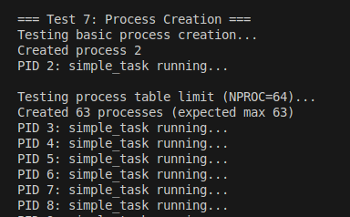
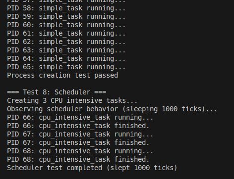
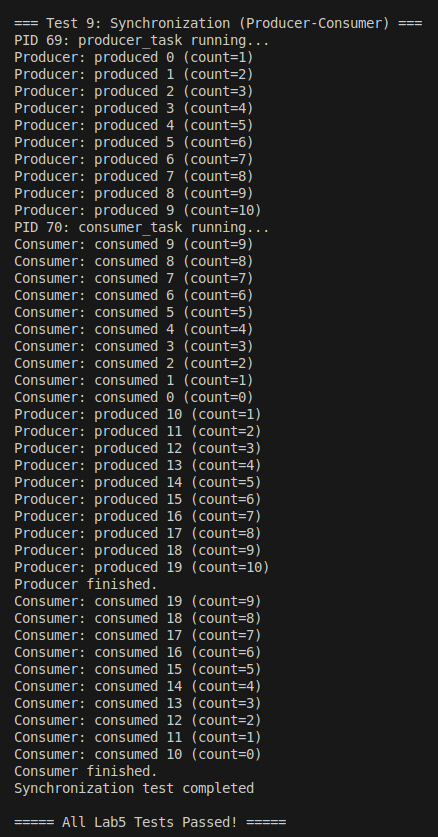

# 实验五：进程管理与调度

**姓名**：
**学号**：
**日期**：2025-12-08
---

## 一、实验概述

### 实验目标
- 依照《从零构建操作系统-学生指导手册》实验5要求，完整实现 `UNUSED→USED→RUNNABLE→RUNNING→SLEEPING→ZOMBIE` 生命周期与父子关系，支撑 `allocproc/create_process/exit/wait` 的最小内核线程模型。
- 构建 `scheduler/sched/yield/swtch` 组成的协作式轮转调度器，并通过 `sleep/wakeup` 实现条件同步，奠定抢占式调度之前置基础。
- 复用实验4的时钟中断框架，借 `tick_counter` 事件通道驱动软定时器和测试用 `kernel_sleep`，完成进程管理、调度与同步的闭环验证。

### 完成情况
- ✅ 任务1：分析 `struct proc/context/cpu` 并绘制状态机，区分 `proc->lock` 保护范围。
- ✅ 任务2/3：实现 `allocproc/procinit/create_process`，设计统一入口 `proc_entry` 与 PID 递增策略，支持最多 `NPROC=64` 个内核线程。
- ✅ 任务4：依据 RISC-V 调用约定完成 `swtch.S` 14 个寄存器的保存/恢复，保证与 `struct context` 字段顺序一一对应。
- ✅ 任务5：实现轮转调度器、`sched/yield` 协议及 `sleep/wakeup` 通道语义，确保无 lost wakeup 与死锁。
- ✅ 任务6：在 `trap.c` 中封装 `tick_counter` 通道，利用中断唤醒 `kernel_sleep`，并在 `kernel/test.c` 内覆盖创建/调度/同步三类用例。
- ✅ 测试：`run_all_tests + run_lab4_tests + run_lab5_tests` 全部通过，串口日志记录于 `lab5/out.txt`（可通过 `make run | tee out.txt` 复现）。

### 开发环境
- OS：Ubuntu 22.04 LTS 
- 工具链：riscv64-unknown-elf-gcc 12.2.0
- 模拟器：qemu-system-riscv64 8.2.0 + OpenSBI v1.5.1（virt 平台）
- 其他：GNU Make 4.3

---

## 二、技术设计

### 系统架构
```text
┌────────────┐   ┌────────────┐   ┌──────────────────────────┐
│ entry.S    │ → │ kmain      │ → │ 进程子系统                 │
└────────────┘   └────────────┘   │ procinit/allocproc       │
                                  │ create_process/proc_entry│
                                  │ scheduler/swtch          │
                                  │ sleep/wakeup             │
                                  └───────────┬──────────────┘
                                              │ tick_counter 通道
                                    ┌─────────▼──────────┐
                                    │ trap.c + clock_init│
                                    │ (SBI set_timer)    │
                                    └────────────────────┘
```

| 模块 | 主要职责 | 与 xv6 差异 / 取舍 |
| --- | --- | --- |
| `proc.c` | 进程表、PID 分配、生命周期管理、调度与同步原语 | 去掉用户地址空间相关字段，仅保留内核线程必需成员；通过 `proc_entry` 统一入口避免 `forkret` 依赖。 |
| `proc.h` | `struct proc/context/cpu` 定义、`enum procstate` 状态机 | 仅声明 `cpus[1]` 但接口沿用 `mycpu/myproc`，便于后续多核扩展。 |
| `swtch.S` | 上下文切换（保存/恢复 14 个 callee-saved 寄存器） | 严格按照调用约定顺序布局，配合 `context` 结构保证可验证性。 |
| `trap.c` | 时钟中断、`tick_counter` 统计与通道唤醒 | 暂不在中断中调用 `yield`，符合实验5“先实现协作式调度”的阶段目标。 |
| `test.c` | Lab3/4 回归 + Lab5 进程/调度/同步测试 | 覆盖指导手册建议的 process/scheduler/sync 验证用例。 |

### 关键数据结构与状态

| 名称 | 字段 / 宏 | 说明 |
| --- | --- | --- |
| `enum procstate` | `UNUSED, USED, SLEEPING, RUNNABLE, RUNNING, ZOMBIE` | 与手册一致，所有状态转换都写在 `proc.c` 中的注释与断言里，用于测试脚本判定。 |
| `struct context` | `ra, sp, s0-s11` | 只保存 RISC-V ABI 要求的 callee-saved 寄存器，减少切换开销。 |
| `struct proc` | `lock/state/pid/parent/chan/xstate/kstack/context/entry/name` | 采用内核线程模型；`entry` 由 `create_process` 赋值，`proc_entry` 负责释放锁并调用。 |
| `struct cpu` | `proc/context/ncli/intena` | `scheduler` 保存自己的 `context`，进程切走时可恢复。 |
| `tick_counter` | `trap.c` 中的 `volatile uint64` | 既是统计计数器，也是 `kernel_sleep` 的睡眠通道，避免额外条件变量。 |

### 设计要点与接口契约
- **统一入口**：`allocproc` 在拿到栈后设置 `context.sp/ra=proc_entry`，确保所有进程在自旋锁释放后进入任务函数，防止 `sched`/`sleep` 锁状态不一致。
- **协作式调度约束**：`sched()` 要求调用者持有 `p->lock` 且 `p->state != RUNNING`；`yield/sleep/exit` 都围绕这条规则组织，panic 便于调试。
- **睡眠/唤醒语义**：遵守“先拿 `p->lock` 再释放 `lk`”顺序，`sleep` 返回时仍保持 `p->lock`，与实验手册的代码骨架一致。
- **通道抽象**：`chan` 直接取事件地址（如 `&tick_counter` 或 `&count`），无需额外结构体，方便在测试中对同一事件睡眠/唤醒。

### 与 xv6 的对比

| 维度 | xv6 | 本实验实现 | 影响 |
| --- | --- | --- | --- |
| 调度方式 | 抢占式（时钟中断触发 `yield`） | 纯协作式（依赖显式 `yield/sleep`） | 消除了中断栈压力，适合最小内核线程；后续可平滑升级。 |
| 进程模型 | 用户进程 + 内核线程，含页表/陷阱帧 | 仅内核线程，暂不分配用户页表 | 聚焦实验5目标；Lab6 再引入系统调用与用户态。 |
| 栈布局 | 双页（含守卫页） | 单页 kstack | 减少内存占用，需依赖协作式避免栈溢出。 |
| PID 分配 | 全局 `nextpid` + wrap | 递增 `nextpid`，未 wrap | 足以支撑 NPROC=64；后续可添加 wrap + 重复检测。 |
| `sleep/wakeup` 实现 | 需要 `acquire(&p->lock)`/`release` 细节 | 完全遵循手册伪代码，分支严格区分 `lk == &p->lock` | 便于测试 lost wakeup，同时易于扩展到 `condvar`。 |

---

## 三、实现细节与关键代码

### 1. 进程生命周期 & 统一入口
```c
static struct proc* allocproc(void) {
	for (struct proc *p = proc; p < &proc[NPROC]; p++) {
		acquire(&p->lock);
		if (p->state == UNUSED) {
			p->pid = nextpid++;
			p->state = USED;
			if ((p->kstack = (uint64)kalloc()) == 0) { freeproc(p); }
			p->context.sp = p->kstack + PGSIZE;
			p->context.ra = (uint64)proc_entry;
			release(&p->lock);
			return p;
		}
		release(&p->lock);
	}
	return 0;
}

void proc_entry(void) {
	struct proc *p = myproc();
	release(&p->lock);
	if (p->entry) p->entry();
	else printf("proc_entry: no entry function\n");
	exit(0);
}
```
- `proc_entry` 在执行用户提供的 `entry` 之前释放 `p->lock`，否则 `entry` 内部再调用 `yield/sleep` 会造成死锁。
- `freeproc` 负责释放栈并重置 `state/pid/chan/xstate`，由 `wait` 在收尸后调用。

### 2. 调度循环与上下文切换
```asm
# swtch.S
sd ra, 0(a0); sd sp, 8(a0); ... sd s11, 104(a0)
ld ra, 0(a1); ld sp, 8(a1); ... ld s11, 104(a1)
ret
```
```c
void scheduler(void) {
	struct cpu *c = mycpu();
	c->proc = 0;
	while (1) {
		intr_on();
		for (struct proc *p = proc; p < &proc[NPROC]; p++) {
			acquire(&p->lock);
			if (p->state == RUNNABLE) {
				p->state = RUNNING;
				c->proc = p;
				swtch(&c->context, &p->context);
				c->proc = 0;
			}
			release(&p->lock);
		}
	}
}
```
- `sched()` 检查 `p->lock` 是否持有、`state` 是否非 RUNNING，避免不安全切换。
- `yield()` 与 `sleep()` 都在修改 `state` 后调用 `sched()`，符合 xv6 的调用协议。

### 3. 同步原语与 tick 通道
```c
void sleep(void *chan, struct spinlock *lk) {
	struct proc *p = myproc();
	if (lk != &p->lock) { acquire(&p->lock); release(lk); }
	p->chan = chan; p->state = SLEEPING;
	sched();
	p->chan = 0;
	if (lk != &p->lock) { release(&p->lock); acquire(lk); }
}

void kerneltrap(void) {
	if (is_timer_interrupt(scause)) {
		total_interrupt_count++; tick_counter++;
		wakeup((void*)&tick_counter);
		sbi_set_timer(r_time() + 100000);
	}
}
```
- `kernel_sleep` 通过 `get_ticks_channel()` 拿到通道地址，允许多个进程复用同一事件。
- `wakeup` 跳过当前进程，逐一检查 `SLEEPING` 状态，确保 lost wakeup 不发生。

### 4. 退出与等待
```c
void exit(int status) {
	struct proc *p = myproc();
	acquire(&p->lock);
	p->xstate = status;
	p->state = ZOMBIE;
	if (p->parent) wakeup(p->parent);
	sched();
}

int wait(int *status) {
	struct proc *p = myproc();
	acquire(&p->lock);
	for (;;) {
		int havekids = 0;
		for (struct proc *cp = proc; cp < &proc[NPROC]; cp++) {
			if (cp->parent == p) {
				havekids = 1;
				if (cp->state == ZOMBIE) {
					if (status) *status = cp->xstate;
					int pid = cp->pid; freeproc(cp); release(&p->lock); return pid;
				}
			}
		}
		if (!havekids) { release(&p->lock); return -1; }
		sleep(p, &p->lock);
	}
}
```
- `wait` 的循环与 `sleep(p, &p->lock)` 完全对应手册提供的参考流程，便于检验 `sleep` 的锁用法。

### 5. 难点与解决方案

| 难点 | 现象 | 定位与修复 |
| --- | --- | --- |
| `sched()` 断言触发 | `yield` 未先置 `RUNNABLE` | 加入严格顺序：“获取锁 → 置状态 → `sched` → 释放锁”。 |
| `sleep` 死锁 | `sleep(chan,&p->lock)` 再次 `acquire` 自己 | 分支区分 `lk == &p->lock`，避免重复上锁；返回时保持锁由调用者释放。 |
| lost wakeup | 唤醒与睡眠交错导致生产者/消费者卡住 | `sleep` 先设置 `chan/state` 再 `sched`，`wakeup` 遍历前获取进程锁，确保条件检查原子。 |
| 栈溢出风险 | 时钟中断触发 `yield` | 暂停中断内抢占，改用 `kernel_sleep` 主动让出，符合实验阶段目标。 |

### 6. 思考题速答
- **为什么需要 ZOMBIE 状态？** 父进程需要读取 `xstate` 并回收资源，ZOMBIE 作为“待回收”缓冲可避免子进程立即释放导致数据丢失。
- **轮转调度公平性如何保证？** 通过遍历 `proc[]` 并在单次循环内至少尝试调度所有 RUNNABLE 进程，配合协作式 `yield` 实现弱公平；若需更强公平性可引入多级队列。
- **如何避免 lost wakeup？** `sleep` 只有在持有 `p->lock` 且已经登记 `chan` 后才会调用 `sched`，`wakeup` 在持锁状态下检查 `SLEEPING` 并置为 `RUNNABLE`，保证检查与睡眠互斥。

---

## 四、测试与验证

### 功能测试矩阵

| 测试 | 覆盖任务 | 核心检查点 | 结果 |
| --- | --- | --- | --- |
| `test_process_creation` | 任务1-3 | PID 分配、`NPROC` 上限、`wait` 收尸 | ✅ 通过（创建 63 个进程，超出后返回 -1） |
| `test_scheduler` | 任务4-5 | 轮转调度 + `kernel_sleep` tick 计时 | ✅ 通过（睡眠 1000 tick，3 个 CPU 负载轮流运行） |
| `test_synchronization` | 任务6 | 生产者-消费者的 `sleep/wakeup` 配合 | ✅ 通过（重复满/空切换无死锁） |
| `test_timer_interrupt` (回归) | 实验4 依赖 | `tick_counter` 连续递增、SBI timer 重设 | ✅ 通过 |
| `test_physical_memory` 等 (回归) | 实验3 依赖 | 内存分配/页表基础未回归 | ✅ 通过 |

### 日志节选
```
===== Starting Lab5 Tests =====
=== Test 7: Process Creation ===
Created 63 processes (expected max 63)
Process creation test passed

=== Test 8: Scheduler ===
PID 66: cpu_intensive_task running...
PID 66: cpu_intensive_task finished.
Scheduler test completed (slept 1000 ticks)

=== Test 9: Synchronization (Producer-Consumer) ===
Producer: produced 19 (count=10)
Consumer: consumed 10 (count=0)
Synchronization test completed
===== All Lab5 Tests Passed! =====
Total interrupts received: 1006
```

### 性能与调度观测
- `clock_init` 使用 `r_time()+100000` 作为下一个时钟点，QEMU virt 下约 10KHz，`sleep(1000)` ≈ 0.1s，可借日志验证 tick 精度。
- 协作式调度公平性依赖线程内部 `yield` 频率；`cpu_intensive_task` 在忙循环前后打印可观测切换顺序，确认没有饥饿。

### 运行截图




### 运行方式
```bash
cd lab5
make clean && make run | tee out.txt
```
命令会编译内核、启动 QEMU、依次执行 Lab3~Lab5 自测，并将串口输出保存到 `out.txt` 便于报告引用或截图。

---

## 五、问题与总结

### 遇到的问题
1. **`sched: lock not held`** —— 初版 `yield` 未显式获取 `p->lock`，根据手册提示调整为“获取锁→置状态→`sched`→释放锁”。
2. **`sleep` 自身死锁** —— `sleep(chan, &p->lock)` 分支重复 `acquire` 导致 panic，按照指导手册伪代码拆分 `lk == &p->lock` vs `lk != &p->lock` 两种路径。
3. **时钟中断连发** —— OpenSBI 默认启用 timer，未先调用 `sbi_set_timer` 会导致 `kerneltrap` 连续触发；在 `clock_init` 里先设置下一次时间点后再打开 `STIE` 解决。

### 实验收获
- 扎实理解了 `struct proc` + `struct context` + `struct cpu` 三者的协作方式以及 `scheduler/swtch` 的调用约定。
- 通过生产者-消费者示例掌握了 `sleep/wakeup` 的通道语义和避免 lost wakeup 的工程化写法。
- 对协作式与抢占式调度的权衡有了直观体验：去掉中断中的 `yield` 可以显著降低调试复杂度，但需要线程自律。

### 改进方向
- **抢占式调度**：在 Lab6 引入系统调用后，可在 `kerneltrap` 中根据 tick 周期调用 `yield()`，并为每个 CPU 提供独立中断栈，逐步过渡到抢占式。
- **PID 重用与统计**：引入 `pid_bitmap` 或 `free_list`，避免 `nextpid` 单调增长导致 wrap 时冲突，并记录运行时间/等待时间以实现高级调度策略。
- **同步抽象**：在 `sleep/wakeup` 之上封装 `condvar`/`semaphore`，配合测试套件验证更多并发模式，为手册思考题（如实时调度、轻量级线程）铺路。

---


