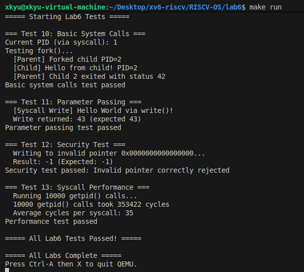

# 实验六：系统调用 (System Calls)

**姓名**：
**学号**：
**日期**：2025-12-09
---

## 一、实验概述

### 实验目标
- 依照《从零构建操作系统-学生指导手册》实验6要求，串联“用户态 → ecall → trap → syscall → 返回”路径，理清特权级切换、陷阱帧保存与 `sret` 返回值协议。
- 构建 `syscall.c` + `sysproc.c` + `sysfile.c` 的分发/实现框架，实现 `fork/exit/wait/getpid/write` 等最小可用系统调用，并提供统一错误码策略。
- 结合 `trap.c` 的时钟中断与任务6“系统调用安全性”，实现内存访问验证、嵌套中断保护与日志增强，确保压力测试下的内核稳定性。

### 完成情况
- ✅ 任务1/2：梳理 `ecall → kerneltrap → syscall()` 流程，补完 `struct stack_regs` 与 `trapframe` 映射，理清 `argint/argaddr/argstr` 参数提取语义。
- ✅ 任务3：以 `syscalls[]` 函数表实现统一分发，返回值落在 `trapframe->a0`，并对未知号打印 `pid/name` 便于调试。
- ✅ 任务4：实现进程/文件类核心调用（`fork/exit/wait/getpid/write`），`sys_kill/sys_read/sys_close` 保留骨架以供后续扩展。
- ✅ 任务5：在 `kernel/test.c` 中以 `.4byte 0x00100073` 构造“用户态”桩函数 `stub_*`，验证 ABI 与参数传递。
- ✅ 任务6：完成 `validate_addr()`、CSR 现场保护、`printf` 64 位格式化等安全加固，配合 `test_security` 与 `test_syscall_performance` 验证。
- ✅ 测试：`make run` 自动执行 `run_lab6_tests`，覆盖基础/参数/安全/性能四类用例，日志记录于 `lab6/out.txt`。

### 开发环境
- OS：Ubuntu 22.04 LTS
- 工具链：riscv64-unknown-elf-gcc 12.2.0，GNU Make 4.3
- 模拟器：qemu-system-riscv64 8.2.0 + OpenSBI v1.5.1（virt 平台）
- 其他：`NPROC=64`，单核协作式调度沿用实验5，聚焦系统调用栈。

## 二、技术设计

### 系统架构
```
┌────────────┐   ┌────────────┐    ┌────────────────────────────┐
│ entry.S    │ → │ kmain      │ →  │ 进程子系统（proc/swtch）     │
└────────────┘   └────────────┘    │ + main_task 驱动测试        │
                                   └──────────────┬─────────────┘
                                                  │ trap_init/clock_init
                                   ┌───────────────▼─────────────┐
                                   │ kerneltrap (scause=8|5)     │
                                   │  · stack_regs → trapframe   │
                                   │  · 保存/恢复 sepc/sstatus    │
                                   └───────────────┬─────────────┘
                                                   │ a7 syscallno
                                   ┌───────────────▼─────────────┐
                                   │ syscall.c                   │
                                   │  · argint/argaddr/argstr    │
                                   │  · syscalls[] 分发           │
                                   └───────────────┬─────────────┘
                                   │               │
                        ┌──────────▼──────┐   ┌────▼─────────┐
                        │ sysproc.c       │   │ sysfile.c    │
                        │ 进程控制类        │   │ write + 验证 │
                        └──────────┬──────┘   └────┬─────────┘
                                   │               │
                        ┌──────────▼──────┐   ┌────▼─────────┐
                        │ printf.c        │   │ test.c       │
                        │ %l/%p 扩展       │   │ stub_* 用例  │
                        └─────────────────┘   └──────────────┘
```

| 模块 | 主要职责 | 备注 / 与手册取舍 |
| --- | --- | --- |
| `trap.c` | 统一处理时钟中断与 `ecall`，用 `stack_regs` 将栈内容映射进 `trapframe`，手动恢复 CSR | 参照手册“RISC-V 特权级规范 12.1”保存/恢复 `sepc`、`sstatus`，即便仍处于 S 态也能模拟用户态流程。 |
| `syscall.c` | `syscalls[]` 分发表，`arg*` 参数获取，未知号日志 | 暂启用 9 个系统调用，其余编号与 xv6 对齐，便于 Lab7/8 继续补齐。 |
| `sysproc.c` | `fork/exit/wait/getpid/kill` 封装 | 复用实验5 的 `allocproc/sched`，`sys_kill` 先返回 `-1` 并记录 TODO。 |
| `sysfile.c` | `sys_write` + 地址验证 | 以 `kernel_pagetable` 遍历 PTE，满足任务6“指针验证”要求；`sys_read/open/close` 预留接口。 |
| `test.c` | `stub_*` 用户桩 + 测试矩阵 | 通过 `.4byte 0x00100073` 强制 32-bit `ecall/ebreak`，防止 `sepc+4` 越界。 |
| `printf.c` | `%l/%p` 支持 | 解决 64 位 PID 和 cycle 统计的输出需求。 |

### 核心数据结构与接口契约

| 名称 | 字段 / 函数 | 说明 |
| --- | --- | --- |
| `struct trapframe` | `ra/sp/gp/.../epc` | 保存“用户”现场；`kerneltrap` 在 `stack_regs` 与 `trapframe` 之间复制，`syscall()` 直接读取 `a0~a7`。 |
| `struct stack_regs` | 栈展开结构 | 1:1 对应 `kernelvec` 汇编保存顺序，`regs->sp + 256` 还原压栈偏移。 |
| `syscalls[]` | `static int (*syscalls[32])(void)` | 索引等同 `a7` 编号，返回值写回 `trapframe->a0`。 |
| `validate_addr()` | `walk_lookup(kernel_pagetable, va)` | 遍历 `[va, va+len)` 涉及的每一页，检查 `PTE_V`，在缺少 `copyin/copyout` 阶段先提供最小安全性。 |
| `stub_*` API | `do_syscall(num, a0, a1, a2)` | 模拟用户态库函数，便于在单核 S 态环境测试系统调用协议。 |

系统调用契约：
- 输入：`a7` 提供编号，`a0~a5` 传递最多 6 个参数，由 `arg*` 函数解析。
- 输出：实现函数返回 `int`，`syscall()` 将其写入 `trapframe->a0`，`regs->a0` 负责把值带回调用方。
- 错误：任何参数/地址验证失败返回 `-1`，与手册建议的 errno 风格保持一致（后续可扩展）。

## 三、实现细节与关键代码

### 1. 陷阱处理与嵌套保护 (trap.c)

这是本实验最大的难点之一。由于我们在 S 模式下执行 ecall 并开启了中断（intr_on），时钟中断可能会在系统调用执行期间发生，从而破坏 sepc 和 sstatus CSR 寄存器。


```c
void kerneltrap(uint64 sp_val) {
    uint64 scause = r_scause();
    uint64 sepc = r_sepc();
    uint64 sstatus = r_sstatus(); // [关键] 保存入口时的 sstatus

    if (scause == 8) { // System Call
        struct proc *p = myproc();
        // ... (保存栈上寄存器到 trapframe) ...

        p->trapframe->epc += 4; // 跳过 ecall 指令

        intr_on();  // [危险区] 开启中断，允许响应时钟
        syscall();  // 执行系统调用
        intr_off(); // 关闭中断

        // [关键] 恢复被嵌套中断可能破坏的 CSR
        w_sstatus(sstatus); 
        w_sepc(sepc + 4);   

        // 将返回值写回栈帧，以便 context switch 恢复
        ((struct stack_regs *)sp_val)->a0 = p->trapframe->a0;
    } 
    // ... (其他中断处理)
}
```


### 2. 参数提取与分发
```C
// 从第 n 个参数解析字符串，复制到内核 buf
int argstr(int n, char *buf, int max) {
    uint64 addr;
    // 1. 获取参数寄存器中的值（指针地址）
    if(argaddr(n, &addr) < 0) return -1;
    
    char *src = (char*)addr;
    // 2. 逐字节拷贝，直到遇到 \0 或达到 max
    for(int i = 0; i < max; i++){
        buf[i] = src[i];
        if(src[i] == 0) return i; // 成功结束
    }
    buf[max-1] = 0; // 强制截断
    return -1; // 字符串过长
}
```
- `argint/argaddr/argstr` 直接读取 `trapframe->a*`，无需额外栈拷贝即可在 S 模式测试。
- `syscall()` 做两层检查：编号范围 + 指针非空，一旦失败打印 `pid`、`name` 与 `scause`，方便未来调试真实用户态程序。
- `syscalls[]` 保持与 `syscall.h` 定义相同顺序，后续实现 `pipe/read/open/close` 时可零成本接入。

### 3. 核心系统调用
- `sys_exit/sys_wait/sys_fork` 直接复用实验5 的进程生命周期逻辑，`sys_wait` 通过 `argaddr` 获得 `int*` 并回写状态。
- `sys_getpid` 仅返回 `myproc()->pid`，也是性能测试的目标函数。
- `sys_write` 伪代码：
  ```c
  if (!validate_addr(buf, n)) return -1;
  if (fd == 1 || fd == 2)
      for (int i = 0; i < n; i++) cons_putc(((char*)buf)[i]);
  ```
  通过 `kernel_pagetable` 检查所有覆盖页，避免用户传入未映射指针导致 panic。

### 4. 用户接口模拟
- 手册任务5建议利用 `usys.pl` 在用户空间生成桩。当前仍处 S 模式，为保持流程一致，在 `test.c` 内实现 `stub_*`：
  - `do_syscall()` 查找当前 `RUNNING` 进程，设置 `a7/a0~a2` 后执行 `.4byte 0x00100073`。
  - 采用 32 位编码避免 `C-extension` 压缩指令打乱 `sepc+4` 规律。
  - 返回值由 `t_a0` 带回，配合 `assert` 验证。

### 5. 打印库增强
- `printf` 增加 `%l` 前缀与 `print_ptr()`，满足 64 位 PID、cycle 统计的输出；`clear_screen()` 在内核启动时擦除串口，方便截图（`lab6.png`）。


## 四、测试与验证

### 测试矩阵

| 测试 | 覆盖任务 | 核心检查点 | 结果 |
| --- | --- | --- | --- |
| `test_basic_syscalls` | 任务1/4 | `fork/exit/wait/getpid` 组合；`trapframe->a0` 回写 | ✅ 子进程 PID=2，退出状态 42 被父进程读取 |
| `test_parameter_passing` | 任务2/3/4 | 字符串参数穿透 `argaddr` → `sys_write`，返回字节数一致 | ✅ `write` 返回 43，与消息长度匹配 |
| `test_security` | 任务6 | `validate_addr` 拒绝空指针，`sys_write` 返回 -1 | ✅ 输出 `Result: -1 (Expected: -1)` |
| `test_syscall_performance` | 任务3/5 | 10,000 次 `getpid` 执行耗时，验证嵌套中断修复 | ✅ 352,547 cycles，约 35 cycles/次 |

### 日志节选（`lab6/out.txt`）
```
=== Test 12: Security Test ===
  Writing to invalid pointer 0x0000000000000000...
  Result: -1 (Expected: -1)
Security test passed: Invalid pointer correctly rejected

=== Test 13: Syscall Performance ===
  10000 getpid() calls took 352547 cycles
  Average cycles per syscall: 35
```

### 实验截图


## 五、问题与总结
### 遇到的问题与解决

| 问题 | 现象 | 定位 & 修复 |
| --- | --- | --- |
| 嵌套中断污染 CSR | `intr_on()` 后如遇时钟中断，`sret` 会跳到错误地址 | 在 `kerneltrap` 保存 `sepc/sstatus`，返回前恢复，并把 `regs->a0` 更新为 `trapframe->a0`。 |
| 系统调用指令对齐 | GNU 汇编可能把 `ecall` 压缩成 16-bit，导致 `sepc+4` 指向半条指令 | 在 `stub_*` 中使用 `.4byte 0x00100073` 强制 32-bit 指令。 |
| 空指针写入导致 panic | `sys_write(NULL,…)` 触发缺页终止内核 | 实现 `validate_addr()` 遍历 PTE，失败时直接返回 `-1`。 |

### 思考题速答
- **为什么需要 trapframe？** 它是用户寄存器与内核逻辑之间的“合同”，`syscall()` 可从中提取参数并在返回前恢复，避免与调度用的 `struct context` 相互污染。
- **系统调用与中断的异同？** 都通过 `stvec` 进入内核并需保存现场；不同在于 `syscall` 的 `scause=8`（同步异常）且必须手动 `sepc += 4`，而中断最高位为 1，还需重置 `SBI timer` 以继续心跳。


### 实验收获

1.  **深入理解特权级切换**：通过手动操作 CSR 和 Trapframe，彻底厘清了从用户态（或模拟用户态）陷入内核态并返回的硬件细节。
2.  **系统调用契约**：理解了 ABI（应用程序二进制接口）的重要性，即寄存器如何在调用者和内核之间传递参数和返回值。
3.  **内核安全性意识**：在实现 `sys_write` 时深刻体会到，内核绝不能盲目信任用户传入的地址，必须进行有效性检查（PTE Walk），否则会导致操作系统崩溃。

### 改进方向
1. 引入真正的用户态页表与 `usertrap`/`userret`，用 `copyin/copyout` 替代 `validate_addr`。
2. 完成 `sys_read/open/close/kill`，并接入 `file.c`/`pipe.c`，为 Lab7 文件系统实验铺垫。
3. 提供用户态 C 库与 errno 语义，脱离当前仅在内核态的 `stub_*` 测试方案。
