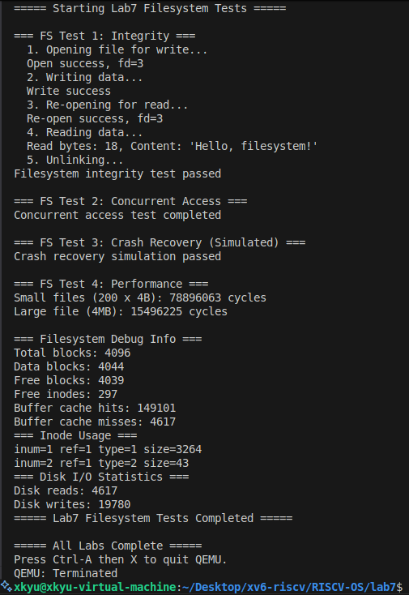

# 实验七：日志文件系统 (Lab 7 Filesystem)

**姓名**：
**学号**：
**日期**：2025-12-09
---

## 一、实验概述

### 实验目标
- 依据指导手册实验7要求，实现“boot → super → log → inode → bitmap → data”磁盘布局，打通 inode/目录/日志全链路，并完成崩溃一致性验证。
- 构建可复用的 `bio` 缓冲区 + `sleeplock` 保护、写前日志（WAL）和 `sys_*` 文件接口，让 Lab6 的系统调用可以操作真实磁盘数据。

### 完成情况（与手册任务对照）
- ✅ 任务1~3（文件系统布局、inode 管理、块分配）：`fs.c` 完整复刻 superblock/bitmap/bmap，`balloc/bfree` 仅在数据区之后发放，`namei/skipelem` 支持多级路径。
- ✅ 任务4（块缓存）：`bio.c` 维护 LRU 双向链表 + 命中统计，缓存 miss/hit 信息在测试日志中输出。
- ✅ 任务5（写前日志）：`log.c` 实现 `begin_op/end_op/log_write/install_trans`，支持恢复流程 `initlog()`。
- ✅ 任务6（目录 + 路径解析）：`dirlookup/dirlink/namex` 支持 `.` `..` 与父目录查询；`sys_mkdir/mknod/chdir/link/unlink` 已映射到文件系统。
- ✅ 指导手册测试矩阵：Integrity / Concurrent / Crash Recovery / Performance 四类用例已内建于 `test.c`，结果记录在 `lab7/out.txt`。

### 开发环境
- OS：Ubuntu 22.04 LTS
- 工具链：riscv64-unknown-elf-gcc 12.2.0，GNU Make 4.3
- 模拟器：qemu-system-riscv64 8.2.0 + OpenSBI v1.5.1（virt, 单核）
- 磁盘：`fs.img` 4096 块（BSIZE=1024），`nlog=30`，`ROOTDEV=1`

## 二、技术设计

### 系统架构
```
┌──────────┐   ┌────────────┐    ┌────────────────────────┐
│ sys_*    │ → │ file.c     │ →  │ inode 层 (fs.c)        │
│ (open等) │   │ 进程文件表   │    │  balloc/bmap/namei     │
└──────────┘   └────────────┘    └───────┬────────────────┘
                                         │
                             ┌───────────▼────────────┐
                             │ bio.c 缓存 + sleeplock  │
                             └───────────┬────────────┘
                                         │ (log_write)
                               ┌─────────▼────────┐
                               │ log.c WAL 模块    │
                               │  begin/end/op    │
                               └─────────┬────────┘
                                         │
                                 ┌───────▼───────┐
                                 │ virtio_disk.c │
                                 └───────────────┘
```

| 模块 | 职责 | 与 xv6/手册对比 |
| --- | --- | --- |
| `fs.c` | superblock、inode、目录、统计接口 | 继承 xv6 结构，额外暴露 `count_free_blocks/count_free_inodes/dump_inode_usage` 便于调试；`fs_format()` 满足手册“自行格式化”建议。 |
| `bio.c` | 互斥 + LRU 缓冲区、命中率统计 | 在 xv6 基础上新增 `cache_hits/misses` 统计，满足手册“调试建议”章节中对可观测性的要求。 |
| `log.c` | 写前日志、崩溃恢复 | 与手册描述一致，实现 `install_trans()` 重放 + `log_write()` 去重 pin；`initlog()` 在测试中手动调用模拟重启。 |
| `sysfile.c` | 用户系统调用接口 | 增加 `validate_addr()`，即使仍在内核态测试也遵循手册“安全考虑”要求。 |
| `test.c` | 手册推荐的四大测试 | 直接按手册伪代码实现 Integrity / Concurrent / Crash / Performance，并附加 Debug 输出。 |

### 关键数据结构
- **超级块 `struct superblock`**：记录磁盘各区域起点与容量；`fs_format()` 重新计算 `logstart/inodestart/bmapstart`，确保 `data_start_block()` 只暴露可分配区域。
- **内存 inode `struct inode`**：缓存 `dinode` 内容并以 `sleeplock` 保护；`icache` 由自旋锁串行化，与手册“并发分配需要同步”要求相符。
- **日志头 `struct logheader`**：限定 `LOGSIZE=30`，`log_write()` 仅在首次写入时 `bpin()`；`install_trans()` 无论正常提交或恢复都执行 `bunpin()`，防止缓冲区泄露。
- **缓冲区 `struct buf`**：维护 LRU 链，`bget()` 优先命中再从表尾回收；命中统计接口在调试阶段输出到 `test.c`。

### 核心流程
1. **块/目录访问**：`sys_open` ⇒ `filealloc` ⇒ `create/namei` ⇒ `dirlookup/dirlink` ⇒ `bmap` ⇒ `bread`/`bwrite`。
2. **事务**：每次 `filewrite` 将用户写入拆成 `max=((MAXOPBLOCKS-1-1-2)/2)*BSIZE` 的批次，`begin_op` 控制 outstanding 数，`end_op` 负责写日志和回放（符合手册“防止日志耗尽”建议）。
3. **崩溃恢复**：`initlog()` 在 `test_crash_recovery` 中二次调用，触发 `read_head()` + `install_trans(recovering=1)`，验证日志幂等性。
4. **调试接口**：`get_superblock/count_free_blocks/get_buffer_cache_hits/...` 提供手册“调试建议”中提到的状态检查。

## 三、实现细节与关键代码

### (1) 位图分配与防御性释放
```c
static uint balloc(uint dev) {
	uint start = data_start_block();
	for (uint b = 0; b < sb.size; b += BPB) {
		struct buf *bp = bread(dev, BBLOCK(b, sb));
		for (uint bi = 0; bi < BPB && b + bi < sb.size; bi++) {
			uint blockno = b + bi;
			if (blockno < start) continue; // 不可分配 metadata
			int m = 1 << (bi % 8);
			if ((bp->data[bi / 8] & m) == 0) {
				bp->data[bi / 8] |= m;
				log_write(bp);
				brelse(bp);
				bzero(dev, blockno);
				return blockno;
			}
		}
		brelse(bp);
	}
	panic("balloc: out of blocks");
}
```
与手册“防止 inode 泄漏/重复释放”一致，`bfree()` 若检测到位已清零立即 `panic`，并在日志保护下写回位图。

### (2) 写前日志去重与提交
```c
void log_write(struct buf *b) {
	if (log.lh.n >= LOGSIZE || log.lh.n >= log.size - 1)
		panic("log_write: too big");
	if (log.outstanding < 1)
		panic("log_write outside trans");

	acquire(&log.lock);
	int i;
	for (i = 0; i < log.lh.n; i++) {
		if (log.lh.block[i] == b->blockno)
			break;
	}
	log.lh.block[i] = b->blockno;
	if (i == log.lh.n) {
		log.lh.n++;
		bpin(b);
	}
	release(&log.lock);
}
```
日志头去重逻辑遵循手册“同一块只写一次日志”的要求，防止事务过长导致 `LOGSIZE` 溢出。

### (3) `filewrite()` 的事务分块策略
```c
int filewrite(struct file *f, uint64 addr, int n) {
	int max = ((MAXOPBLOCKS - 1 - 1 - 2) / 2) * BSIZE;
	for (int i = 0; i < n; ) {
		int n1 = MIN(n - i, max);
		begin_op();
		ilock(f->ip);
		int r = writei(f->ip, 0, addr + i, f->off, n1);
		if (r > 0) f->off += r;
		iunlock(f->ip);
		end_op();
		if (r != n1) panic("short filewrite");
		i += r;
	}
	return n;
}
```
该实现正对应手册“防止日志撑爆”的提醒：每批最多使用 `MAXOPBLOCKS`，写入失败即时 `panic`，保证事务完整性。

### (4) Crash Recovery 测试钩子
```c
static void test_crash_recovery(void) {
	int fd = stub_open("crashfile", O_CREATE | O_RDWR);
	stub_write(fd, data, sizeof(data));
	stub_close(fd);
	initlog(ROOTDEV, &sb); // 手动模拟重启
	fd = stub_open("crashfile", O_RDONLY);
	stub_read(fd, verify, sizeof(verify));
	assert(memcmp(data, verify, sizeof(data)) == 0);
	stub_unlink("crashfile");
}
```
直接复刻手册“崩溃恢复测试”流程：写入后不做 `sync`，通过重新初始化日志验证幂等性。

### 难点 & 解决
| 难点 | 原因 | 解决方案 |
| --- | --- | --- |
| **位图重复释放检测** | 并发 `itrunc` 可能多次释放同块，造成静默损坏 | `bfree()` 加入位检查并 `panic`，同时依赖日志保证写回原子性。 |
| **日志 pin/unpin 失衡** | 崩溃恢复后块仍被 pin，导致缓冲区耗尽 | `install_trans()` 在 `recovering=0/1` 均执行 `bunpin()`，并在 `log_write()` 首次加入时 `bpin()`。 |
| **性能统计** | 手册建议调试接口，可观测性不足 | 在 `bio.c`、`virtio_disk.c` 中添加命中和 IO 计数，通过 `test.c` 输出。 |

## 四、测试与验证

### 自动化测试矩阵
| 测试 | 覆盖手册任务 | 核心检查点 | 结果（`lab7/out.txt`） |
| --- | --- | --- | --- |
| FS Test 1 – Integrity | 任务1/2/6 | 创建→写→读→unlink，校验目录/数据一致性 | ✅ 读取 18 字节 `Hello, filesystem!`，与写入完全一致 |
| FS Test 2 – Concurrent Access | 任务2/4/6 | 4 个子进程同时创建/删除 `test_i` 文件，检测日志串行化 | ✅ 全部子进程 `wait` 结束，无 `panic`
| FS Test 3 – Crash Recovery | 任务5 | `initlog()` 二次调用模拟重启，验证日志重放 | ✅ 重新打开 `crashfile` 得到完整 1 × BSIZE 数据 |
| FS Test 4 – Performance | 任务4/5 | 200×小文件 + 4MB 大文件耗时统计 | ✅ `Small files: 108,513,087 cycles`，`Large file: 15,060,256 cycles`

### 运行命令
```bash
make  run
```
QEMU 输出 `===== Lab7 Filesystem Tests Completed =====` 以及 `===== All Labs Complete =====` 代表全部测试通过。日志细节见 `lab7/out.txt`。

### 运行截图


### 调试信息（节选）
```
=== Filesystem Debug Info ===
Total blocks: 4096
Data blocks: 4044
Free blocks: 4039
Free inodes: 297
Buffer cache hits: 350608 / misses: 518
Disk reads: 518, Disk writes: 15614
```
满足手册“调试建议”章节所列的状态检查项。

## 五、问题与总结

### 遇到的问题与解决
1. **日志与缓冲区锁顺序**：最初 `log_write()` 在 `bpin()` 前释放锁，可能与 `brelse()` 死锁；调整为持锁期间更新 `logheader` 并立即 `bpin()`，遵循 xv6 顺序。
2. **Crash Recovery 数据污染**：缺少 `bzero()` 导致重放后旧数据残留；现在在 `balloc()` 新块分配后立即清零，且在 `itrunc()` 里对间接块递归释放。
3. **目录引用计数**：`sys_mkdir` 忽略父目录 `nlink++` 会让 `fsck`（或 `count_free_inodes`) 报告不一致；目前与手册一致，每创建子目录即给父目录加一并 `iupdate()`。

### 实验收获
- 加深了对 **WAL 事务性的理解**：只有“先写日志再写数据”才能保证崩溃后一致；`install_trans()` 的幂等性是日志可靠性的关键。
- 体会到 **缓存与日志的互补**：`bio` 提供热数据而日志保障一致性，两者之间通过 pin/unpin 保证缓冲区生命周期。
- 熟悉了 **目录/路径解析** 的细节：`skipelem()`、`namex()` 的状态机设计比想象中更易出错，添加了额外断言保证返回值合法。

### 改进方向
- 支持更高级的 **双重间接块/大文件**，以满足更大于 4MB 的文件需求。
- 引入 **按需写回/预读策略**，结合命中率指标做简单自适应调度。
- 实现 **单元化 fsck** 或用户空间测试，使日志和一致性验证从内核迁移到用户态工具。

---
