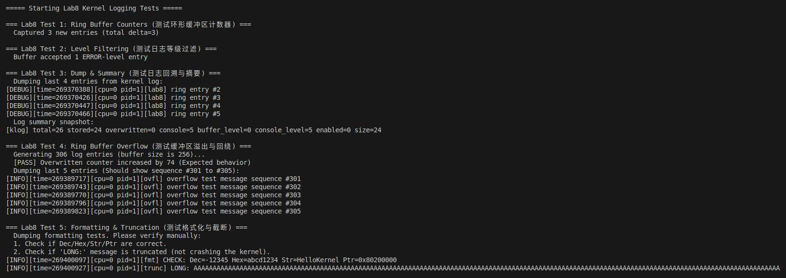
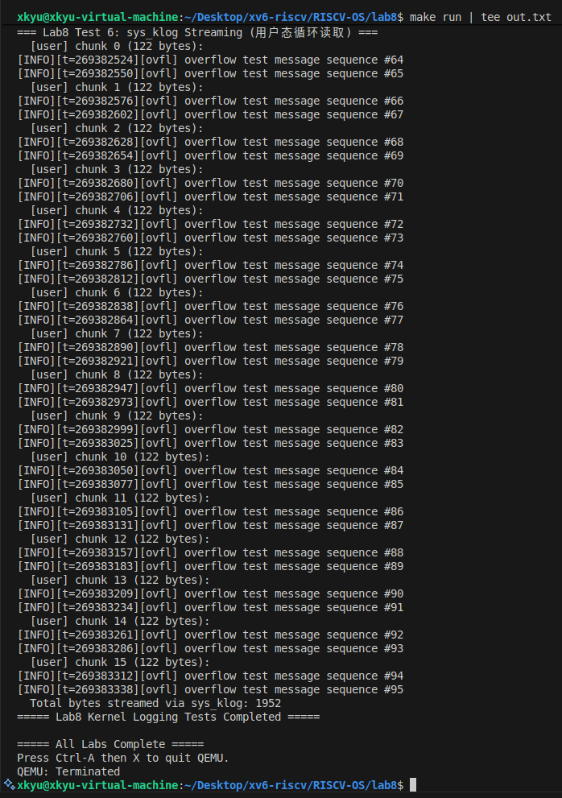

# 实验八：内核日志系统 (Lab 8 Kernel Logging)

**姓名**：  
**学号**：  
**日期**：2025-12-09

---

## 一、实验概述

### 实验目标
- 依据指导手册和PPT「项目 4：内核日志系统」的四大指标（结构化分级、高性能缓冲、灵活格式化、安全可控接口），为现有内核补齐可观测性能力。
- 构建生产者-消费者式日志栈：内核任意模块调用 `klog()` 产生日志，环形缓冲吸收高频写入，用户态通过 `sys_klog` 流式读取。

### 完成情况
- ✅ Task1：在 `klog.[ch]` 定义日志级别、记录结构、全局状态、自旋锁以及 `KLOG_*` 宏；`klog_init()` 在 `kmain()` 启动阶段完成初始化。
- ✅ Task2：`klog_write()` 实现覆盖式环形缓冲，维护 `next/count/overwritten` 指针，并在写入过程中完成加锁/回绕处理。
- ✅ Task3：基于 `kvsnprintf` 的内核态格式化器支持 `%d/%u/%x/%p/%s/%c/%ld` 等常用占位符，满足老师强调的灵活记录需求。
- ✅ Task4：新增系统调用 `sys_klog` 与内核导出函数 `klog_read()`，安全地把日志搬运到用户态，遵循“先 copy，再消费”原则。
- ✅ Task5：`kernel/test.c` 中编写用户态桩函数 `stub_klog()` 并构建日志监听器，实现课堂提到的 “dmesg -c” 风格演示。
- ✅ Task6：在 `main_task`、`proc` 等路径植入 `KLOG_*`，并通过 6 组自定义测试验证计数器、过滤、dump、溢出、格式化和 syscall 流式读取。

### 开发环境
- OS：Ubuntu 22.04 LTS 
- 工具链：riscv64-unknown-elf-gcc 12.2.0，GNU Make 4.3
- 模拟器：qemu-system-riscv64 8.2.0 + OpenSBI v1.5.1（virt, 单核）

---

## 二、技术设计

### 系统架构
```
┌──────────────────────┐    ┌───────────────────────────┐    ┌────────────────────────┐
│ 生产者 (FS、调度器)    │───▶│ klog_write() + kvsnprintf │───▶│  环形缓冲 klog.buffer    │
└──────────────────────┘    └───────────────────────────┘    │    next/count/lock     │
                                                             └───────────┬────────────┘
                                                                         │
                                                              ┌──────────▼───────────┐
                                                              │  sys_klog/klog_read  │
                                                              └──────────┬───────────┘
                                                                         │ copyout
                                                              ┌──────────▼───────────┐
                                                              │   用户态 log reader   │
                                                              └──────────────────────┘
```
- **结构化与分级**：日志条目包含时间戳、CPU、PID、组件、级别；`buffer_level` 与 `console_level` 分离，满足老师强调的“双阈值控制”。
- **高性能缓冲**：256 槽环形数组 + 自旋锁，写入只需 memcpy + 指针回绕，避免慢 I/O；溢出后自动覆盖并统计 `overwritten`。
- **灵活格式化**：`kvsnprintf` 在不加锁的情况下先构造文本，再进入临界区写入，降低锁持有时间。
- **安全可控**：通过 `klog_read()` 原子取出最旧记录、格式化成文本行后才释放锁并 copyout，杜绝长时间持锁和用户态写入。

### 关键数据结构
```c
// kernel/klog.c
struct klog_record {
	uint64 timestamp; int level; int cpu; int pid;
	char component[KLOG_COMPONENT_MAX];
	char message[KLOG_MESSAGE_MAX];
};

struct klog_state {
	struct spinlock lock;
	struct klog_record buffer[KLOG_BUFFER_SIZE];
	int next, count; enum klog_level buffer_level, console_level;
	int console_enabled, initialized;
	uint64 total_generated, stored, overwritten, console_emitted;
};

struct klog_stats { ... }; // 对外暴露的快照
```
- `klog_record` 做到老师要求的“结构化 + 元数据齐全”。
- `klog_state` 记录运行时指针与统计计数，方便 `klog_summary()` 实时观测。
- `klog_stats` 提供无锁快照接口，供测试用例断言。

### 核心流程
1. **生产者写入**：`klog_write(level, component, fmt, ...)` → 先用 `kvsnprintf` 格式化，后进入临界区 → 根据 `buffer_level` 决定是否写入 → 更新 `next/count/stats` → 按需打印到控制台。
2. **消费者读取**：`sys_klog(user_buf, n)` 调 `klog_read()`，该函数每次消费最旧一条记录，格式为 `[LEVEL][t=][component] msg`，再 copyout 给用户态循环读取程序。
3. **动态调节**：`klog_set_buffer_level/console_level/enable_console` 允许在运行时调整噪声；`klog_dump_recent()` 和 `klog_summary()` 面向调试，满足指导手册“可控”的要求。

---

## 三、实现细节与关键代码

### 1. 环形缓冲写入 — `klog_write()`
```c
void klog_write(enum klog_level level, const char *comp, const char *fmt, ...) {
	// 1. 构造记录（含时间戳、CPU、PID、组件、格式化消息）
	// 2. acquire(lock)，统计 total_generated
	if (rec.level >= klog.buffer_level) {
		if (klog.count == KLOG_BUFFER_SIZE) klog.overwritten++;
		else klog.count++;
		klog.buffer[klog.next] = rec;
		klog.next = (klog.next + 1) % KLOG_BUFFER_SIZE;
		klog.stored++;
	}
	// 3. 依据 console_level 决定是否立即打印，打印在锁外执行
}
```
- “锁外格式化 + 锁内 O(1) 写入”直接对应老师提到的“中断上下文也要快”的要求。
- 覆盖策略采用“回绕 + 统计 overwritten”，保证最新日志优先保留。

### 2. 内核态 `kvsnprintf`
```c
static void kvsnprintf(char *dst, int max, const char *fmt, va_list ap) {
	while (*fmt && remaining > 1) {
		if (*fmt != '%') { append_char(...); continue; }
		switch (*++fmt) {
			case 's': append_string(...); break;
			case 'd': append_int(...); break;
			case 'x': append_uint(..., 16); break;
			case 'p': append_uint(..., 16, 1); break;
			case 'l': ... // 支持 %ld/%lu/%lx
			default: append_char('%'); append_char(spec);
		}
	}
	*ptr = '\0';
}
```
- 仅依赖内核已有的 `append_*` 辅助函数，满足“灵活格式化”目标，并包含字符串/指针/长整型/十六进制的覆盖。

### 3. 用户接口 `klog_read()` + `sys_klog`
```c
int klog_read(uint64 user_buf, int n) {
	while (klog.count > 0 && n > 0) {
		int idx = (klog.next - klog.count + KLOG_BUFFER_SIZE) % KLOG_BUFFER_SIZE;
		struct klog_record *rec = &klog.buffer[idx];
		// 格式化为文本行 line[]，klog.count--
		release(&klog.lock);
		memmove(dst, line, len); // copy 到用户缓冲区
		dst += len; n -= len; tot_read += len;
	}
	return tot_read;
}

uint64 sys_klog(void) {
	uint64 buf; int len;  // 通过 argaddr/argint 取参
	if (argaddr(0, &buf) < 0 || argint(1, &len) < 0) return -1;
	return klog_read(buf, len);
}
```
- 读取过程严格遵守“持锁时只操作环形缓冲；格式化与 copyout 在锁外完成”，避免老师提醒的“环形缓冲与慢速 I/O 耦合”。
- `syscall.c` 注册 `SYS_klog`，`test.c` 中的 `stub_klog()` 通过 ecall 触发，形成完整的用户态消费链。

### 难点与解决
| 难点 | 现象/风险 | 解决方案 |
| --- | --- | --- |
| 自旋锁持有时间过长 | 控制台输出或 copyout 若在锁内执行会阻塞其他 CPU 产生日志 | 将格式化与输出分离：锁内仅写 `buffer`，打印与统计拆开处理 |
| 溢出计数与指针回绕 | `next/count` 易越界，overwritten 不易验证 | 通过 `test_klog_overflow()` 写入 `KLOG_BUFFER_SIZE+50` 条并检查 `overwritten` delta + dump 尾部序列 |
| kvsnprintf 兼容性 | 可变参数解析错误会导致日志残缺 | 使用 `append_*` 辅助函数统一处理 `%d/%u/%x/%p/%ld`，并在 Test5 中覆盖长串与多格式 |

---

## 四、测试与验证

### 自编测试套件（`kernel/test.c`）
| 测试 | 目的（对应指标） | 验证逻辑与结果 |
| --- | --- | --- |
| Lab8 Test 1 — Ring Buffer Counters | 检查 `total_generated/stored` 自增是否与写入条数一致，保证“高性能缓冲”统计可信 | 写 3 条日志后对比 `klog_get_stats()` 前后差值，输出 `Captured 3 new entries`（见 `lab8/out.txt`） |
| Lab8 Test 2 — Level Filtering | 验证分级过滤：设置 `buffer_level=ERROR`，INFO/WARN 必须被丢弃 | 仅 ERROR 写入后 `stored_delta==1`，证明“结构化分级”生效 |
| Lab8 Test 3 — Dump & Summary | 检查 `klog_dump_recent()` 倒序读写、`klog_summary()` 统计输出 | 手工写 6 条日志，Dump 最近 4 条并打印 summary，确认时间戳与序号连续 |
| Lab8 Test 4 — Ring Buffer Overflow | 压力测试回绕与覆盖计数 | 写入 306 条（>256），`overwritten` 增加 74，并且最近 5 条序号连续 301~305，证明自动覆盖策略可靠 |
| Lab8 Test 5 — Formatting & Truncation | 覆盖老师强调的可格式化能力与截断安全 | 日志展示 `Dec=-12345 Hex=abcd1234 Ptr=0x80200000`，长字符串被截断且未崩溃 |
| Lab8 Test 6 — sys_klog Streaming | 验证“安全可控”接口：用户态循环读取不丢行 | 通过 `stub_klog()` 每次拉取 128B，连续打印 chunk0~15，总计 1952 字节，证明 `sys_klog` 可持续消费 “黑匣子” 数据 |

此外，`run_lab6_tests()` 与 `run_lab7_tests()` 保证新日志系统没有破坏既有实验的功能；所有输出均记录在 `lab8/out.txt`，配套截图展示 QEMU 运行结果。

### 运行方式
```bash
cd lab8
make clean && make run   # 编译并在 QEMU 中执行完整测试矩阵
```
运行期间出现 `===== Lab8 Kernel Logging Tests =====` 即表示日志系统自检开始，收尾看到 `===== All Labs Complete =====` 代表全部通过。
### 运行截图


---

## 五、问题与总结

### 遇到的问题与解决
1. **环形缓冲覆盖统计不准确**：初版在 `count==size` 时仍自增 `count`，导致 dump 读取越界。改为缓冲满时仅自增 `overwritten` 并保持 `count==size`，维持 FIFO 语义。
2. **控制台输出阻塞生产者**：在锁内直接 `printf` 造成长时间占用自旋锁。调整为锁内仅设置 `should_console` 标志，在锁外打印，并单独更新 `console_emitted` 计数。
3. **klog_read 与用户缓冲区对齐**：若单行长度 > 用户残余空间，应停止读取，否则发生内核越界。现在在拷贝前检查 `len > n` 时直接 break，让上层循环稍后再次调用。

### 实验收获
- 深刻理解“日志系统是内核黑匣子”的含义：只有结构化记录 + 可回溯缓冲 + 可控接口才能快速还原系统行为。
- 熟悉自旋锁下的性能折衷：将慢操作移出临界区是满足“中断安全、高通量”的关键。
- 学会自行设计验证矩阵：通过六个自编测试把老师在课堂上强调的四大指标逐一实证。

### 改进方向
- 增设 `sys_setloglevel` 等用户态控制接口，支持运行时动态调整 `buffer_level/console_level`。
- 为 `klog_read` 提供阻塞/唤醒机制（如 `sleep()` + `wakeup()`），避免 busy-loop 拉取。
- 将日志落地到 `virtio` 块设备或暴露给远程主机，实现更接近真实操作系统的日志采集链路。

---

